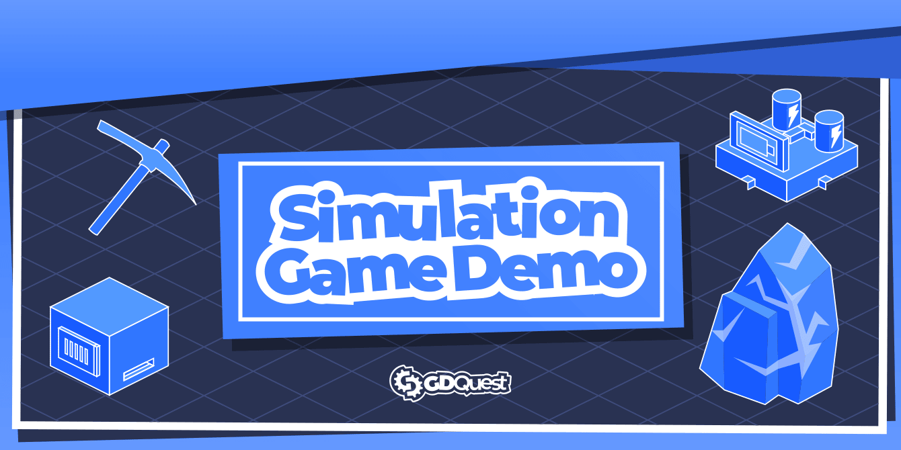

# Builder game in Godot

An isometric simulation and builder game inspired by Factorio designed for the course [Godot 2D Secrets](https://gdquest.mavenseed.com/courses/godot-2d-secrets). Gather resources, build machines and pipes, and create more and more.

It's Free and Open Source Software and made in Godot.

➡ Follow us on [Twitter](https://twitter.com/NathanGDQuest) and [YouTube](https://www.youtube.com/c/gdquest/) for free game creation tutorials, tips, and news!
